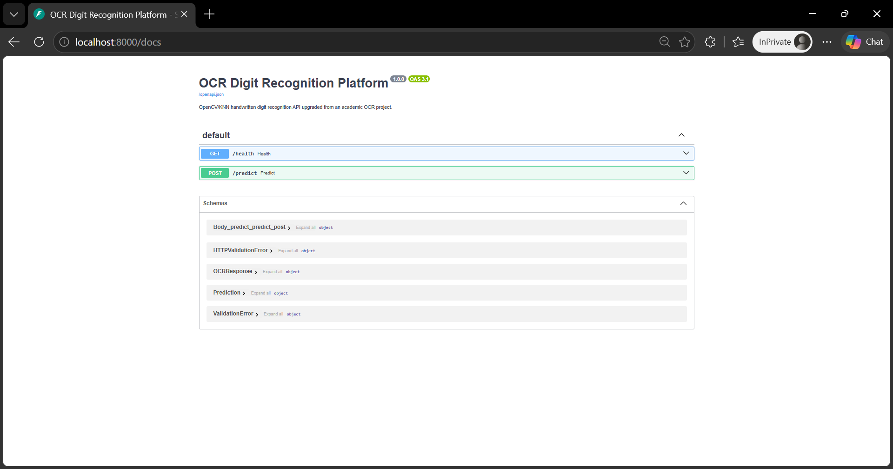
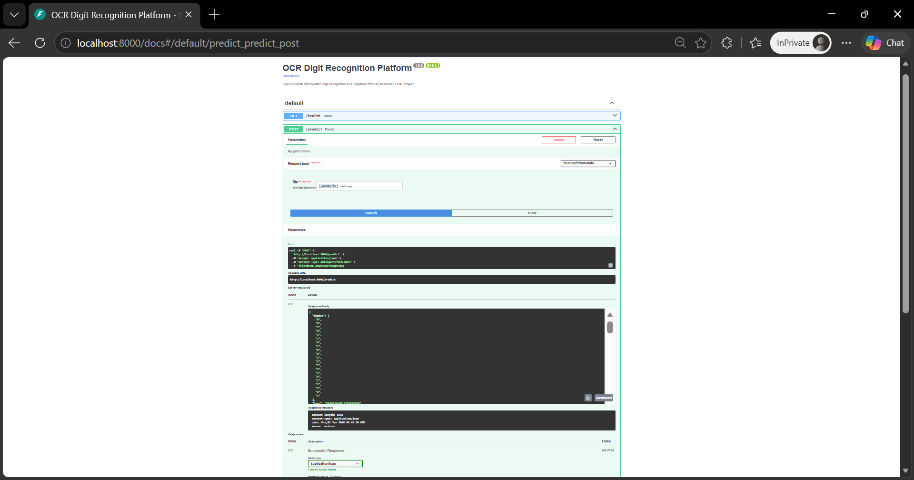
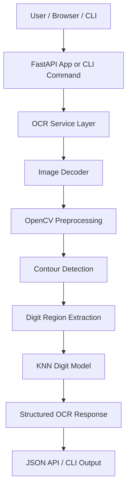

<div align="center">

# 🔢 OCR Digit Recognition Platform

### Production-ready handwritten digit recognition platform built with OpenCV, KNN, FastAPI, Docker, and CI/CD.

<p>
  
  
  
</p>

<p>
  
  
  
</p>

<p>
  <a href="#-overview">Overview</a> •
  <a href="#-features">Features</a> •
  <a href="#-screenshots">Screenshots</a> •
  <a href="#-architecture">Architecture</a> •
  <a href="#-quick-start">Quick Start</a> •
  <a href="#-api-reference">API</a> •
  <a href="#-troubleshooting">Troubleshooting</a>
</p>

</div>

---

## 📌 Overview

**OCR Digit Recognition Platform** is a production-style computer vision project that recognizes handwritten digits from uploaded images using OpenCV preprocessing and a K-Nearest Neighbors classification pipeline.

The project is **portfolio-grade ML serving platform** with a FastAPI API, command-line interface, Docker support, CI/CD, automated tests, linting, security checks, and documentation.

It demonstrates how a notebook/script-style computer vision assignment can be converted into a maintainable backend service suitable for GitHub, demos, interviews, and future cloud deployment.

---

## ✨ Features

<table>
<tr>
<td width="33%" valign="top">

### 🔍 OCR Pipeline

- Image loading and validation
- Grayscale conversion
- Thresholding and contour detection
- Digit region extraction
- KNN-based digit prediction
- Structured prediction response

</td>
<td width="33%" valign="top">

### 🧩 Platform

- FastAPI application
- Swagger/OpenAPI docs
- Image upload endpoint
- CLI prediction command
- Health check endpoint
- Local-first project setup

</td>
<td width="33%" valign="top">

### 🚀 Engineering

- Python package structure
- Docker support
- GitHub Actions CI
- Pytest unit tests
- Ruff linting
- Bandit security scan

</td>
</tr>
</table>

---

## 🧱 Tech Stack

<div align="center">

<table>
<tr>
<td align="center" width="25%">
<br/>
<b>Python</b><br/>
Backend
</td>

<td align="center" width="25%">
<br/>
<b>FastAPI</b><br/>
API
</td>

<td align="center" width="25%">
<br/>
<b>OpenCV</b><br/>
Computer Vision
</td>

<td align="center" width="25%">
<br/>
<b>KNN</b><br/>
Classifier
</td>
</tr>

<tr>
<td align="center">
<br/>
<b>Pytest</b><br/>
Testing
</td>

<td align="center">
<br/>
<b>Git</b><br/>
Version Control
</td>

<td align="center">
<br/>
<b>GitHub Actions</b><br/>
CI/CD
</td>

<td align="center">
<br/>
<b>Docker</b><br/>
Containerization
</td>
</tr>
</table>

</div>

---

## 📸 Screenshots

<p align="center">
  
  
</p>

---

## 🏗️ Architecture

<div align="center">



</div>

### 🔄 End-to-End Workflow

```text
User uploads or passes an image
        ↓
FastAPI endpoint or CLI command receives the image
        ↓
Image is decoded and validated
        ↓
OpenCV converts the image to grayscale and thresholds it
        ↓
Contours are detected and filtered into digit regions
        ↓
Each digit region is resized and normalized
        ↓
KNN model predicts each digit
        ↓
Service returns detected digits, combined text, and bounding boxes
```

### System Flow

| Step |                        What Happens                         |
|------|-------------------------------------------------------------|
|  1   | User sends an image through Swagger UI, curl, or CLI        |
|  2   | API/CLI validates the file path or uploaded image bytes     |
|  3   | OpenCV preprocessing extracts candidate digit contours      |
|  4   | KNN model predicts each extracted digit region              |
|  5   | Response returns digit list, combined text, and coordinates |
|  6   | Tests and CI validate the platform before GitHub updates    |

---

<details>
<summary><strong>📁 Folder Structure</strong></summary>

```text
ocr-digit-recognition-platform/
├── src/
│   └── ocr_platform/
│       ├── api.py              # FastAPI routes
│       ├── cli.py              # CLI entrypoint
│       ├── config.py           # Runtime settings
│       ├── model.py            # KNN training and prediction
│       ├── preprocessing.py    # OpenCV image processing
│       ├── schemas.py          # Pydantic response models
│       └── service.py          # OCR orchestration layer
├── tests/
│   └── test_preprocessing.py   # Unit tests
├── data/
│   ├── training/digits.jpg     # Training image sheet
│   └── samples/                # Sample OCR inputs
├── docs/
│   ├── screenshots/            # README screenshots
│   └── original-project-report.pdf
├── .github/workflows/ci.yml
├── Dockerfile
├── docker-compose.yml
├── pyproject.toml
├── LICENSE
└── README.md
```

</details>

---

## ⚡ Quick Start

### Prerequisites

| Requirement |       Version      |
|-------------|--------------------|
|    Python   | 3.11+              |
|    Docker   | Optional           |
|     Git     | Any recent version |

### Install Locally

```bash
git clone https://github.com/TaranjyotS/ocr-digit-recognition-platform.git
cd ocr-digit-recognition-platform
python -m venv .venv
source .venv/bin/activate  # Windows: .venv\\Scripts\\activate
pip install -e .[dev]
```

### Run API

```bash
uvicorn ocr_platform.api:app --reload
```

Open:

```text
http://localhost:8000/docs
```

### Run CLI

```bash
ocr-platform predict data/samples/num1.png
```

### Run Tests

```bash
pytest -q
```

### Run Quality Checks

```bash
ruff check .
bandit -r src
```

### Run with Docker

```bash
docker compose up --build
```

Open:

```text
http://localhost:8000/docs
```

---

## 🔌 API Reference

### Health Check

```bash
curl http://localhost:8000/health
```

### Predict Digits

```bash
curl -X POST http://localhost:8000/predict \
  -F "file=@data/samples/num1.png"
```

### Example Response

```json
{
  "digits": ["0", "8", "2"],
  "text": "082",
  "predictions": [
    {
      "digit": "0",
      "x": 14,
      "y": 28,
      "width": 22,
      "height": 30,
      "confidence_distance": 871143.0
    }
  ]
}
```

---

## 🧪 What This Project Demonstrates

|        Skill Area      |                Demonstrated Through                    |
|------------------------|--------------------------------------------------------|
| Computer Vision        | OpenCV preprocessing, thresholding, contour extraction |
| Machine Learning       | KNN-based digit classification pipeline                |
| Backend Engineering    | FastAPI endpoint design and structured service layer   |
| API Design             | Health check, upload endpoint, typed response schemas  |
| Production Readiness   | Docker, CI/CD, tests, linting, security checks         |
| Software Architecture  | Modular package structure instead of one large script  |
| Portfolio Storytelling | Academic project upgraded into a deployable ML service |

---

## 🧰 Troubleshooting

<details>
<summary><strong>CLI says: Got unexpected extra argument</strong></summary>

Use the revised CLI included in this repository. The command should be:

```bash
ocr-platform predict data/samples/num1.png
```

If your local environment still uses an older installed version, reinstall the package:

```bash
pip uninstall ocr-digit-recognition-platform -y
pip install -e .[dev]
```

Then run:

```bash
ocr-platform --help
ocr-platform predict data/samples/num1.png
```

</details>

<details>
<summary><strong>Swagger UI opens but prediction fails</strong></summary>

Make sure you are uploading a valid image file such as:

```text
data/samples/num1.png
data/samples/num2.png
```

The API expects a multipart form upload under the field name `file`.

</details>

<details>
<summary><strong>OpenCV import error</strong></summary>

This project uses the server-friendly package:

```text
opencv-python-headless
```

Reinstall dependencies:

```bash
pip install -e .[dev]
```

</details>

<details>
<summary><strong>uvicorn command not found</strong></summary>

Install project dependencies first:

```bash
pip install -e .[dev]
```

Or run with Python:

```bash
python -m uvicorn ocr_platform.api:app --reload
```

</details>

<details>
<summary><strong>pytest-asyncio warning appears</strong></summary>

The warning does not block tests. If desired, add this to `pyproject.toml`:

```toml
[tool.pytest.ini_options]
asyncio_default_fixture_loop_scope = "function"
```

</details>

---

## 🔄 Recommended Clean Rebuild

```bash
python -m venv .venv
source .venv/bin/activate  # Windows: .venv\\Scripts\\activate
pip install --upgrade pip
pip install -e .[dev]
ruff check .
bandit -r src
pytest -q
uvicorn ocr_platform.api:app --reload
```

---

## 🗺️ Roadmap

| Priority |                         Improvement                           |
|----------|---------------------------------------------------------------|
|   High   | Add model artifact persistence instead of training on startup |
|   High   | Add request-size limits and image validation guardrails       |
|  Medium  | Add confidence normalization and better prediction scoring    |
|  Medium  | Add batch image prediction endpoint                           |
|  Medium  | Add frontend upload dashboard                                 |
|   Low    | Add cloud deployment templates for AWS ECS or Render          |
|   Low    | Add observability with logs, metrics, and request tracing     |
|   Low    | Add deep-learning OCR model comparison                        |

---

## 📄 License

This project is licensed under the [MIT License](LICENSE).

---

## ⚠️ Disclaimer

This project is intended for educational, portfolio, and computer vision learning purposes.

The OCR model is based on a classical OpenCV + KNN workflow and is best suited for clean handwritten digit images similar to the included training format.
